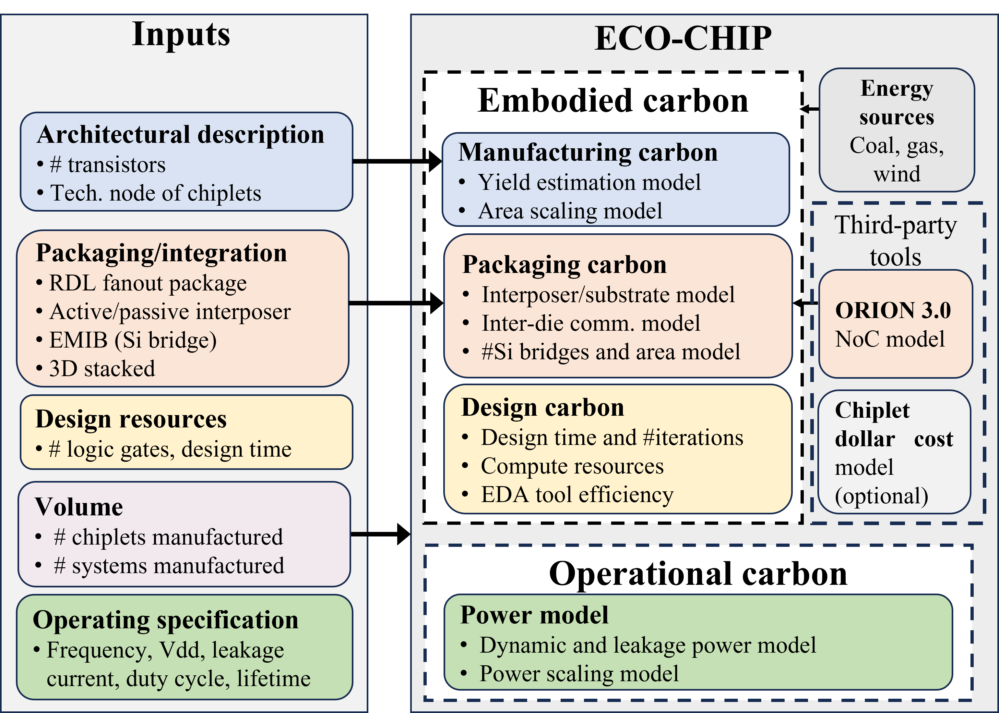

# ECO-CHIP

Carbon footprint estimator for heterogenous chiplet-based systems. 
ECO-CHIP is an analysis tool that analyzes the operational and embodied CFP (design, manufacturing, and packaging). The tool supports the following HI and packaging architectures: RDL fanout, silicon bridge-based, passive and active interposer, and 3D integration. The tool evaluates the crucial package/assembly carbon emissions essential for HI systems, considering size, yield, and assembly process. In addition, it also estimates design CFP.  




## Table of Contents

-   [File structure](#file-structure)
-   [Getting started](#getting-started)
-   [Config and input definition](#input-definition-and-config)
-   [Running ECO-CHIP](#running-eco-chip)
-   [Outputs](#outputs)


## File structure

- **config/**
  - **example/**
    - [architecture.json](./config/example/architecture.json)
    - [designC.json](./config/example/designC.json)
    - [node_list.txt](./config/example/node_list.txt)
    - [operationalC.json](./config/example/operationalC.json)
    - [packageC.json](./config/example/packageC.json)
- [README.md](./README.md)
- **src/**
  - [CO2_func.py](./src/CO2_func.py)
  - [ECO_chip.py](./src/ECO_chip.py)
  - [tech_scaling.py](./src/tech_scaling.py)
- **tech_params/**
  - [analog_scaling.json](./tech_params/analog_scaling.json)
  - [beol_feol_scaling.json](./tech_params/beol_feol_scaling.json)
  - [cpa_scaling.json](./tech_params/cpa_scaling.json)
  - [defect_density.json](./tech_params/defect_density.json)
  - [dyn_pwr_scaling.json](./tech_params/dyn_pwr_scaling.json)
  - [gates_perhr_scaling.json](./tech_params/gates_perhr_scaling.json)
  - [logic_scaling.json](./tech_params/logic_scaling.json)
  - [sram_scaling.json](./tech_params/sram_scaling.json)
  - [transistors_scaling.json](./tech_params/transistors_scaling.json)
- **testcases/**
  - **A15/**
    - [architecture.json](./testcases/A15/architecture.json)
    - [designC.json](./testcases/A15/designC.json)
    - [node_list.txt](./testcases/A15/node_list.txt)
    - [operationalC.json](./testcases/A15/operationalC.json)
    - [packageC.json](./testcases/A15/packageC.json)
  - **EMR2/**
    - [architecture.json](./testcases/EMR2/architecture.json)
    - [designC.json](./testcases/EMR2/designC.json)
    - [node_list.txt](./testcases/EMR2/node_list.txt)
    - [operationalC.json](./testcases/EMR2/operationalC.json)
    - [packageC.json](./testcases/EMR2/packageC.json)
  - **GA102/**
    - [architecture.json](./testcases/GA102/architecture.json)
    - [designC.json](./testcases/GA102/designC.json)
    - [node_list.txt](./testcases/GA102/node_list.txt)
    - [operationalC.json](./testcases/GA102/operationalC.json)
    - [packageC.json](./testcases/GA102/packageC.json)
  - **TigerLake/**
    - [architecture.json](./testcases/TigerLake/architecture.json)
    - [designC.json](./testcases/TigerLake/designC.json)
    - [node_list.txt](./testcases/TigerLake/node_list.txt)
    - [operationalC.json](./testcases/TigerLake/operationalC.json)
    - [packageC.json](./testcases/TigerLake/packageC.json)

## Getting started

### Prerequisites

ECO-CHIP requires the following:

- python 3.9
- pip 22.04
- python3-venv

Additionally, please refer to the requirements.txt file in this repository. The packages in requirements.txt will be installed in a virtual environment.

### Download and install with bash

```
git clone <path>
cd ECO-CHIP
python3 -m venv eco-chip
source eco-chip/bin/activate
pip3 install -r requirements.txt
```

## Input definition and config

ECO-CHIP has three inputs, including a design configuration file, a list of supported technology nodes, and technology/scaling parameter files which are all described below: 

### Architecture configuration

The input system architecture is specified in [architecture.json](config/example/architecture.json) file. The high-level details of each chiplet must be specified as shown below. In the example below, there are three chiplets named chiplet1, chiplet2, and chiplet3.  Each chiplet has its type, which currently includes one of three categories: logic, analog, or sram. To select from five distinct pacakging architectures, the parameter 'pkg_type' can be used with "RDL", "EMIB", "passive", "active" and "3D". The area of each chiplet is also specified in mm2, as shown below.  

```
{
"chiplet1" : {
          "type" : "logic",
          "area" : 16.04
        },
"chiplet2" : {
          "type" : "analog",
          "area" : 24.47
        },
"chiplet3" : {
          "type" : "sram",
          "area" : 10.84
       },
"pkg_type" : "RDL"
}
```
The above file can be extended to support any number of chiplets by adding more entries to the JSON file. 

### Design carbon parameters
The [designC.json](./config/example/designC.json) includes parameters such as the number of design iterations, volume (indicating the number of manufactured parts), and the overall architecture power. Additionally, it encompasses parameters like transistors_per_gate, power_per_core which is the power consumed by the compute resources used for design, as well as carbon_per_kWh, indicating the carbon footprint per kWh from the source. The transistor per gate is used to calculate the number of logic gates in the design which is further used to evaluate design effort. 

### Technology node list

The [node_list.txt](./config/node_list.txt) file specifies the possible combination of nodes each chiplet can be implemented in. The current node_list.txt file contains [7,10,14] and ECO-CHIP generates the CFP for  all feasible combinations for 7nm, 10nm and 14nm, for all the chiplets specified in design.json. ECO-CHIP currently supports the following nodes 7nm, 10nm, 14nm, 22nm, and 28nm. 

### Operational carbon parameters
In [operationalC.json](./config/example/operationalC.json) the lifetime value parameter is provided in hours as its unit of measurement. The current example file demonstrates a lifetime of 2 years (2*365*24 = 17520)

### Pacakge carbon parameters
The [packageC.json](./config/example/packageC.json) contains all the package-related parameters. The Interposer node defines the technology node for the interposer used, RDLLayer defines the number of RDL layers, TSV pitch (pitch per mm) and TSV size (per mm) used for 3D packaging architecture, EMIB bridge range value is defined with emib_pitch parameter and the numBEOL for number of BEOL layers. 

### Technology/scaling parameters 

The [tech params directory](./tech_params/.) holds the scaling factors along with other additional parameters such as CPA, defect density, area scaling, and dynamic_power scaling values  needed for computing CFP for a given chiplet type. 
Analog, logic, and memory exhibit varying scaling rates [[1]][AMD-scaling] [[2]][Intel-Scaling]. Incorporating the transistor density scaling trends from [[3]][TSMC-scaling] [[4]][SRAM-scaling] allows us to address distinct scaling factors for different design types. By factoring in scaling trends in analog, memory, and logic, ECO-CHIP computes CFP.


## Running ECO-CHIP

Modify config/desing.json to the required design with an area for each type (logic, analog and memory). Modify config/nodes.txt to the desired nodes for which CFP needs to be explored across. 
    
The command for CFP exploration across nodes : 

```sh
python3 src/ECO_chip.py --design_dir config/example/
```

To run one of the testcases :
```sh
python3 src/ECO_chip.py --design_dir testcases/TigerLake/
python3 src/ECO_chip.py --design_dir testcases/GA102/
```

## Outputs

Example output for Tiger Lake test case with 7nm and 10nm nodes in node_list.txt file. 

```
 ---------------------------------------------------------
Using below files for CFP estimations : 

testcases/TigerLake/architecture.json
testcases/TigerLake/node_list.txt
testcases/TigerLake/designC.json
testcases/TigerLake/operationalC.json
testcases/TigerLake/packageC.json
 ---------------------------------------------------------
 
Tiger Lake Example
 ---------------------------------------------------------
Total Carbon in Kgs 
                   CPU    Analog    Memory  Packaging
(7, 7, 7)     4.080696  6.225351  2.757777   0.000000
(7, 7, 10)    4.049248  6.188555  2.358879   0.249973
(7, 10, 7)    4.049248  5.332162  2.733506   0.247428
(7, 10, 10)   4.049248  5.332162  2.358879   0.244610
(10, 7, 7)    4.654580  6.188555  2.733506   0.316642
(10, 7, 10)   4.654580  6.188555  2.358879   0.313825
(10, 10, 7)   4.654580  5.332162  2.733506   0.311279
(10, 10, 10)  4.679425  5.355272  2.372339   0.000000
 ---------------------------------------------------------
```

Example output for GA102 testcase with 7nm,10nm and 14nm in the node_list.txt file.

```
 ---------------------------------------------------------
Using below files for CFP estimations : 

testcases/GA102/architecture.json
testcases/GA102/node_list.txt
testcases/GA102/designC.json
testcases/GA102/operationalC.json
testcases/GA102/packageC.json
 ---------------------------------------------------------
 
GA102 Example
 ---------------------------------------------------------
Total Carbon in Kgs 
                   GPU_1     Analog     Memory  Packaging
(7, 7, 7)     159.489739  34.535283  22.057850   0.000000
(7, 7, 10)    151.568257  30.268690  16.669729   2.843666
(7, 7, 14)    151.568257  30.268690  19.163890   3.115038
(7, 10, 7)    151.568257  26.169941  19.215874   2.840955
(7, 10, 10)   151.568257  26.169941  16.669729   2.837954
(7, 10, 14)   151.568257  26.169941  19.163890   3.109326
(7, 14, 7)    151.568257  23.178908  19.215874   2.838437
(7, 14, 10)   151.568257  23.178908  16.669729   2.835436
(7, 14, 14)   151.568257  23.178908  19.163890   3.106808
(10, 7, 7)    179.683055  30.268690  19.215874   5.099623
(10, 7, 10)   179.683055  30.268690  16.669729   5.096622
(10, 7, 14)   179.683055  30.268690  19.163890   5.495352
(10, 10, 7)   179.683055  26.169941  19.215874   5.093910
(10, 10, 10)  185.975276  29.176100  18.634914   0.000000
(10, 10, 14)  179.683055  26.169941  19.163890   5.489639
(10, 14, 7)   179.683055  23.178908  19.215874   5.091393
(10, 14, 10)  179.683055  23.178908  16.669729   5.088391
(10, 14, 14)  179.683055  23.178908  19.163890   5.487121
(14, 7, 7)    255.435629  30.268690  19.215874   9.708866
(14, 7, 10)   255.435629  30.268690  16.669729   9.705864
(14, 7, 14)   255.435629  30.268690  19.163890  10.344212
(14, 10, 7)   255.435629  26.169941  19.215874   9.703153
(14, 10, 10)  255.435629  26.169941  16.669729   9.700152
(14, 10, 14)  255.435629  26.169941  19.163890  10.338499
(14, 14, 7)   255.435629  23.178908  19.215874   9.700635
(14, 14, 10)  255.435629  23.178908  16.669729   9.697634
(14, 14, 14)  272.730433  28.346999  25.408279   0.000000
 ---------------------------------------------------------
```


  [AMD-scaling]: <https://ieeexplore.ieee.org/document/9063103>
  [Intel-scaling]: <https://www.computer.org/csdl/proceedings-article/hcs/2022/09895532/1GZiGKCWYMw>
  [TSMC-scaling]: <https://www.angstronomics.com/p/the-truth-of-tsmc-5nm>
  [SRAM-scaling]: <https://fuse.wikichip.org/news/7343/iedm-2022-did-we-just-witness-the-death-of-sram/#google_vignette>


